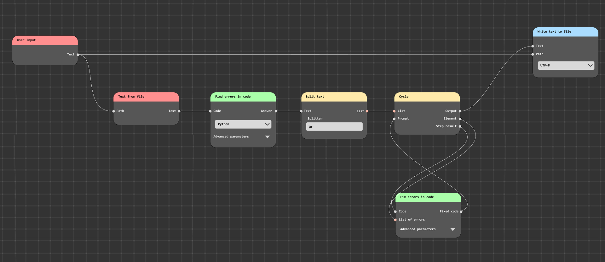

# NodeGPT: Node-based GPT Agents

NodeGPT aims to reimagine the way we interact with GPT agents by breaking them into modular, node-based components. Drawing inspiration from visual programming paradigms like Blender's material nodes, NodeGPT offers more control, transparency, and customizability to users.

  
*The concept of the NodeGPT graphical interface*

## Features

- **Modular Design**: Each node is designed for a specific task, making troubleshooting and updates easier.
- **Customizable Workflows**: Design your AI workflows by connecting nodes as per your needs.
- **Transparent Operation**: Monitor each step of the AI's decision-making process.
- **Optimized Performance**: Assign tasks to appropriate nodes for efficient processing.

## Getting Started

### Installation

1. Clone the repository:
   ```
   git clone https://github.com/RuslanKoroy/node-gpt.git
   ```

2. Navigate to the project directory:
   ```
   cd NodeGPT
   ```

3. Install Python dependencies:
   ```
   pip install -r requirements.txt
   ```

4. Run `main.py` script:
    ```
    python main.py
    ```

## Roadmap

- [ ] Basic node creation and connection
- [ ] Implement GPT-specific nodes
- [ ] Design intuitive user interface